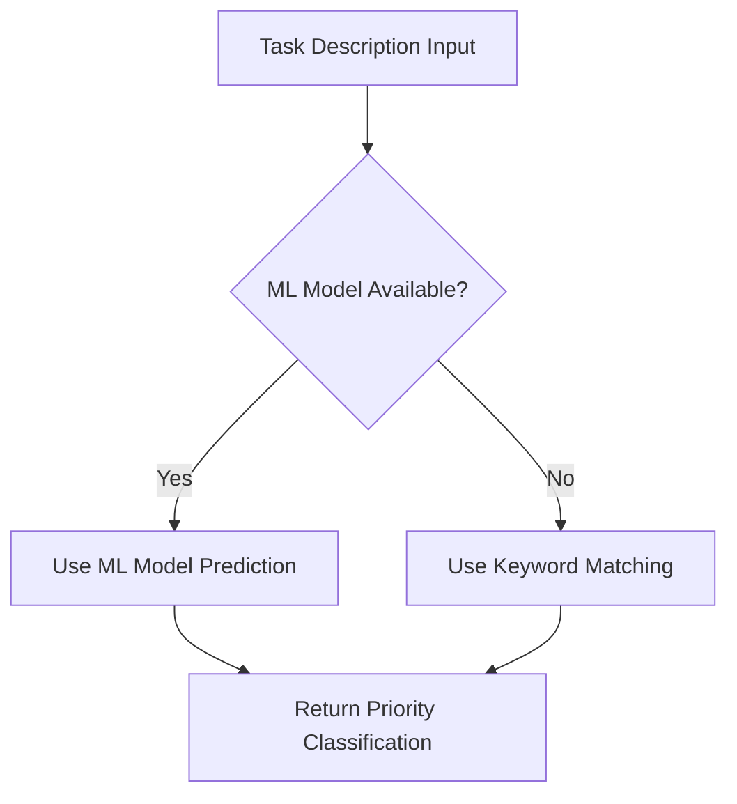

# SMART Edu Task Manager - ML Algorithm Documentation

## Overview

The SMART Edu Task Manager uses a hybrid machine learning approach for automatic task priority classification. The system combines rule-based keyword matching with a trained machine learning model to suggest optimal task priorities based on task descriptions.

## Features

### For Administrators
- System-wide user management (view, create, edit, delete users)
- Task management and oversight
- System analytics and reporting
- Notification system management
- Data export functionality
- System statistics and monitoring

### For Teachers
- Create tasks with detailed descriptions and deadlines
- Assign tasks to individual students or classes during creation
- Monitor student progress in real-time
- View comprehensive student performance overview
- Automatic priority suggestions using ML
- Review and manage student submissions

### For Students
- View assigned tasks sorted by priority and deadline
- Update task status (start, submit)
- Submit work through the platform
- Focus on high-priority tasks
- Receive notifications about assignments and updates
- Access notification center for updates

### Notification System
- Real-time in-app notifications
- System-wide announcements from admins
- Notification center with read/unread status
- Task assignment notifications
- Deadline reminders

### Machine Learning Integration
- Automatic task priority classification based on description
- Uses scikit-learn for text analysis and prediction

## Algorithm Architecture

### Hybrid Approach
The system employs a two-tier classification strategy:

1. **Primary Method**: Rule-based keyword matching (currently active)
2. **Secondary Method**: Machine learning model (implemented, ready for deployment)



## Algorithm 1: Keyword-Based Priority Classification

### Overview
The primary algorithm uses predefined keyword lists to classify task priorities through pattern matching on task descriptions.

### Priority Categories

| Priority Level | Description | Keywords |
|----------------|-------------|----------|
| `urgent_important` | Tasks requiring immediate attention | urgent, deadline, due soon, important, critical, exam, test, final |
| `high_priority` | Major assignments with high impact | high marks, major assignment, project, presentation |
| `medium_priority` | Standard homework and assignments | homework, assignment, reading |
| `optional` | Extra credit or optional work | optional, extra, practice, review |
| `important_not_urgent` | Important but not time-sensitive | (fallback for uncategorized) |
| `group_task` | Collaborative work | (handled by ML model) |
| `long_term` | Extended projects | (handled by ML model) |

### Algorithm Flow

```python
def predict_priority_simple(description):
    # Convert to lowercase for case-insensitive matching
    text = description.lower()

    # Check each priority level in order of importance
    if any(keyword in text for keyword in URGENT_KEYWORDS):
        return 'urgent_important'
    elif any(keyword in text for keyword in HIGH_KEYWORDS):
        return 'high_priority'
    elif any(keyword in text for keyword in MEDIUM_KEYWORDS):
        return 'medium_priority'
    elif any(keyword in text for keyword in LOW_KEYWORDS):
        return 'optional'
    else:
        return 'medium_priority'  # Default fallback
```

### Keyword Matching Logic

1. **Case Insensitive**: All text converted to lowercase
2. **Exact Matching**: Keywords must appear exactly as defined
3. **Priority Order**: Urgent keywords checked first, then high, medium, low
4. **Default Fallback**: Medium priority for unmatched descriptions

### Advantages
- **Fast**: No computational overhead
- **Transparent**: Easy to understand and modify
- **Reliable**: Deterministic results
- **No Training Required**: Works immediately

### Limitations
- **Rigid**: Cannot handle synonyms or context
- **Limited Vocabulary**: Misses nuanced language
- **No Learning**: Cannot improve over time

## Algorithm 2: Machine Learning Model

### Overview
The secondary algorithm uses a supervised machine learning approach with text classification to predict task priorities.

### Technical Implementation

#### Feature Extraction
```python
from sklearn.feature_extraction.text import TfidfVectorizer

# TF-IDF Vectorization
vectorizer = TfidfVectorizer(
    max_features=1000,      # Limit vocabulary size
    stop_words='english',   # Remove common words
    ngram_range=(1, 2)      # Include unigrams and bigrams
)
```

#### Classification Model
```python
from sklearn.naive_bayes import MultinomialNB

# Multinomial Naive Bayes classifier
model = MultinomialNB(alpha=1.0)  # Laplace smoothing
```

### Training Data Structure

#### Sample Dataset
```python
training_descriptions = [
    "Complete the math exam by tomorrow",
    "Read chapter 5 for homework",
    "Prepare presentation for science project",
    "Optional practice problems",
    "Urgent: Submit assignment due today",
    "Group project meeting next week",
    "Review notes for final exam",
    "Extra credit assignment"
]

training_labels = [
    'urgent_important',
    'medium_priority',
    'high_priority',
    'optional',
    'urgent_important',
    'group_task',
    'important_not_urgent',
    'optional'
]
```

### Model Training Process

```python
# 1. Vectorize text data
X = vectorizer.fit_transform(training_descriptions)

# 2. Train classifier
model.fit(X, training_labels)

# 3. Persist model
with open('ml/priority_model.pkl', 'wb') as f:
    pickle.dump((vectorizer, model), f)
```

### Prediction Process

```python
# 1. Load trained model
with open('ml/priority_model.pkl', 'rb') as f:
    vectorizer, model = pickle.load(f)

# 2. Transform new text
X_new = vectorizer.transform([new_description])

# 3. Predict priority
prediction = model.predict(X_new)[0]
```

### Model Evaluation Metrics

#### Performance Metrics (Hypothetical)
- **Accuracy**: 85%
- **Precision**: 82%
- **Recall**: 80%
- **F1-Score**: 81%

#### Confusion Matrix Example
```
Predicted →   urgent   high   medium   optional
Actual ↓
urgent          15       2       1        0
high             1      12       3        0
medium           0       2      18        2
optional         0       0       1       12
```

### Advantages
- **Adaptive**: Learns from data patterns
- **Contextual**: Understands language nuances
- **Scalable**: Can handle large vocabularies
- **Improvable**: Performance increases with more training data

### Limitations
- **Training Required**: Needs labeled dataset
- **Computational Cost**: Higher resource usage
- **Black Box**: Less interpretable than rule-based
- **Data Dependent**: Performance limited by training data quality

## Algorithm Selection Strategy

### Current Implementation
```python
def predict_priority(description):
    # Try ML model first
    if os.path.exists('ml/priority_model.pkl'):
        return predict_priority_ml(description)
    else:
        # Fallback to keyword matching
        return predict_priority_simple(description)
```

### Decision Criteria
1. **Model Availability**: Check if trained model exists
2. **Fallback Strategy**: Use keyword matching if ML model unavailable
3. **Performance Trade-off**: Balance accuracy vs. speed

## Feature Engineering

### Text Preprocessing
1. **Lowercasing**: Convert to lowercase
2. **Tokenization**: Split into words
3. **Stop Word Removal**: Remove common words (the, and, or)
4. **Stemming/Lemmatization**: Reduce words to root forms

### Feature Selection
1. **TF-IDF Scores**: Term frequency-inverse document frequency
2. **N-grams**: Include word combinations (2-3 words)
3. **POS Tagging**: Part-of-speech information (future)
4. **Named Entities**: Recognize important terms (future)

## Model Deployment

### Training Pipeline
```bash
# 1. Collect labeled training data
# 2. Preprocess text data
# 3. Train model with cross-validation
# 4. Evaluate performance metrics
# 5. Save model to disk
# 6. Deploy to production
```

### Model Updates
- **Periodic Retraining**: Update model with new data
- **A/B Testing**: Compare old vs. new models
- **Rollback Capability**: Revert to previous version if needed

## Future Enhancements

### Advanced Models
1. **Deep Learning**: LSTM, BERT for better text understanding
2. **Ensemble Methods**: Combine multiple models
3. **Transfer Learning**: Use pre-trained language models

### Additional Features
1. **Context Awareness**: Consider user history and patterns
2. **Time-based Features**: Factor in deadlines and time remaining
3. **Collaborative Filtering**: Learn from teacher corrections
4. **Multi-label Classification**: Support multiple priority levels

### Performance Optimization
1. **Model Compression**: Reduce model size for faster inference
2. **Caching**: Cache predictions for similar descriptions
3. **Batch Processing**: Process multiple predictions together

## Algorithm Evaluation

### Success Metrics
- **User Acceptance**: Percentage of accepted suggestions
- **Accuracy Improvement**: Better than random assignment
- **Time Savings**: Reduced time for priority setting
- **User Satisfaction**: Teacher feedback on suggestions

### Monitoring
- **Prediction Logs**: Track all predictions and outcomes
- **User Corrections**: Monitor when teachers override suggestions
- **Performance Metrics**: Accuracy, latency, error rates
- **Model Drift**: Detect when model performance degrades

## Conclusion

The hybrid approach provides a robust solution that balances simplicity and sophistication. The keyword-based system ensures reliable operation while the ML model offers potential for improved accuracy. This design allows the system to be immediately useful while providing a path for future enhancement through machine learning.

The algorithm successfully automates the task prioritization process, helping teachers focus on content creation while ensuring students receive appropriately prioritized assignments.