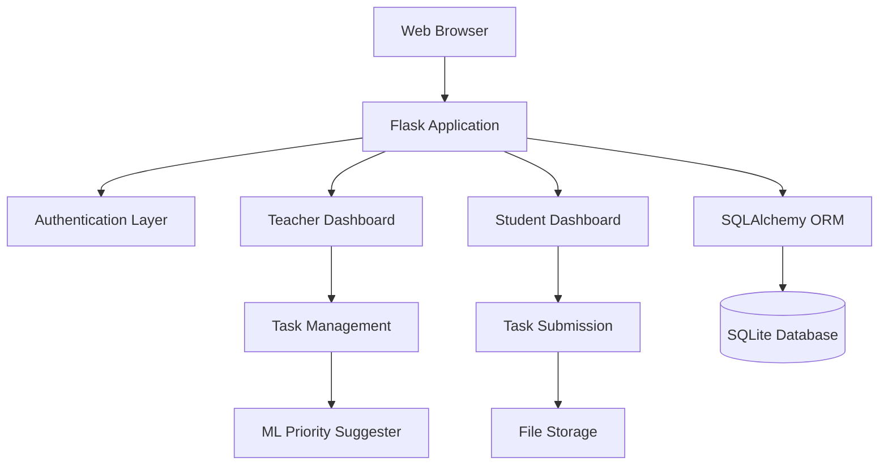

# SMART Edu Task Manager - System Architecture Plan

## Overview
The SMART Edu Task Manager is a web-based platform built with Python and machine learning to facilitate task management between teachers and students. The system emphasizes priority-based task classification to help students focus on critical assignments.

## Features

### For Administrators
- System-wide user management (view, create, edit, delete users)
- Task management and oversight
- System analytics and reporting
- Notification system management
- Data export functionality
- System statistics and monitoring

### For Teachers
- Create tasks with detailed descriptions and deadlines
- Assign tasks to individual students or classes during creation
- Monitor student progress in real-time
- View comprehensive student performance overview
- Automatic priority suggestions using ML
- Review and manage student submissions

### For Students
- View assigned tasks sorted by priority and deadline
- Update task status (start, submit)
- Submit work through the platform
- Focus on high-priority tasks
- Receive notifications about assignments and updates
- Access notification center for updates

### Notification System
- Real-time in-app notifications
- System-wide announcements from admins
- Notification center with read/unread status
- Task assignment notifications
- Deadline reminders

### Machine Learning Integration
- Automatic task priority classification based on description
- Uses scikit-learn for text analysis and prediction

## Technology Stack
- **Backend Framework**: Flask (Python web framework)
- **Database**: SQLite with SQLAlchemy ORM
- **Authentication**: Flask-Login
- **Machine Learning**: scikit-learn for task priority classification
- **Frontend**: HTML5, CSS3, JavaScript with Bootstrap framework
- **File Handling**: Flask-WTF for form handling and file uploads

## System Components

### 1. User Management
- **User Types**: Teachers and Students
- **Authentication**: Secure login system with password hashing
- **Registration**: Separate forms for teachers (with subject/class info) and students (with class info)

### 2. Database Schema
- **Users Table**: id, name, email, password_hash, user_type, subject (for teachers), class (for students)
- **Tasks Table**: id, title, description, deadline, priority, created_by (teacher_id), instructions
- **Assignments Table**: id, task_id, student_id, status (pending/in_progress/completed/overdue), submitted_at
- **Submissions Table**: id, assignment_id, content, file_path (if uploaded)

### 3. Teacher Dashboard
- Task creation with priority selection and direct student assignment
- Access to all registered students for task assignment during creation
- Progress monitoring with status tracking
- Real-time updates on student submissions

### 4. Student Dashboard
- View assigned tasks sorted by priority and deadline
- Update task status (start working, mark complete)
- Submit work with file uploads
- Time management assistance through priority visualization

### 5. Machine Learning Integration
- **Purpose**: Automatically suggest task priorities based on description analysis
- **Model**: Text classification using TF-IDF vectorization and SVM/Naive Bayes
- **Training Data**: Pre-labeled task descriptions with priority categories
- **Integration**: Optional suggestion during task creation, teacher can override

## Architecture Diagram

## Security Considerations
- Password hashing with Werkzeug
- Session management with Flask-Login
- Input validation and sanitization
- File upload restrictions (type, size)
- Role-based access control

## Deployment Considerations
- Local development with SQLite
- Production-ready with PostgreSQL
- Static file serving
- Environment variable configuration

## Development Phases
1. Project setup and dependency installation
2. Database design and models
3. Authentication system
4. Core dashboard functionality
5. ML model development and integration
6. File upload and submission system
7. Testing and refinement
8. Documentation

This architecture provides a scalable foundation for the SMART Edu Task Manager with room for future enhancements like real-time notifications, advanced analytics, and mobile app integration.